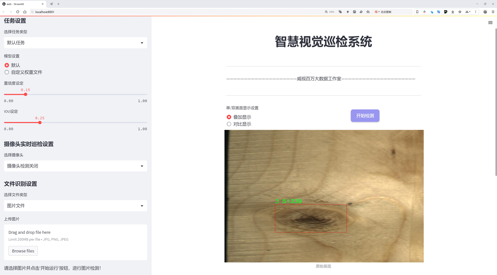
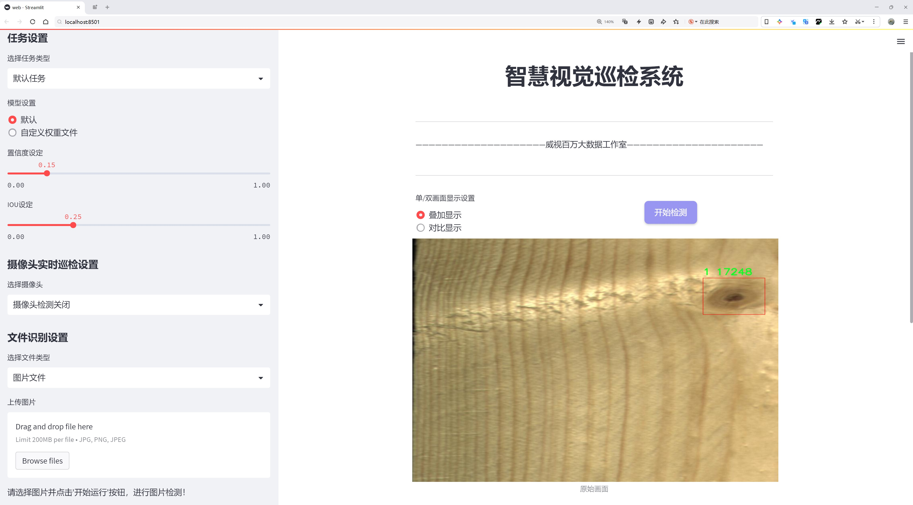
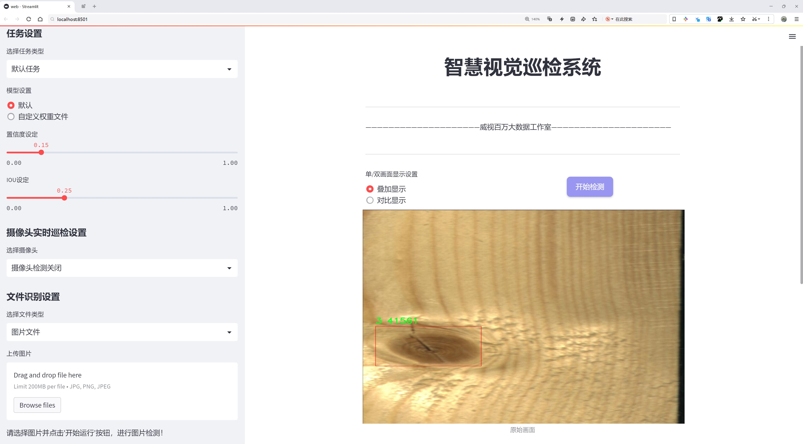
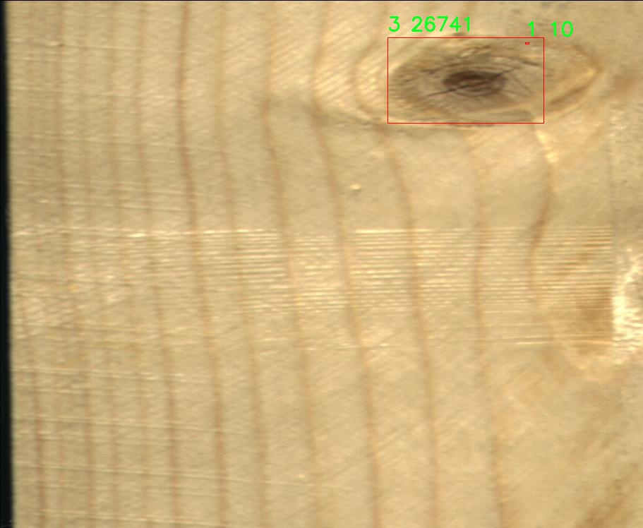
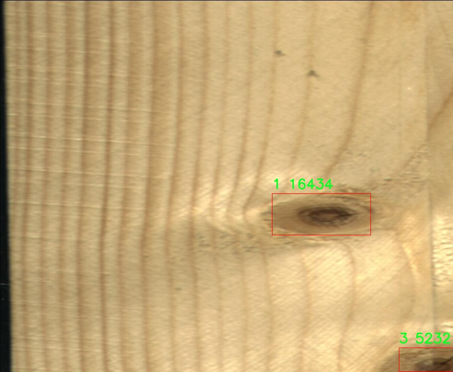
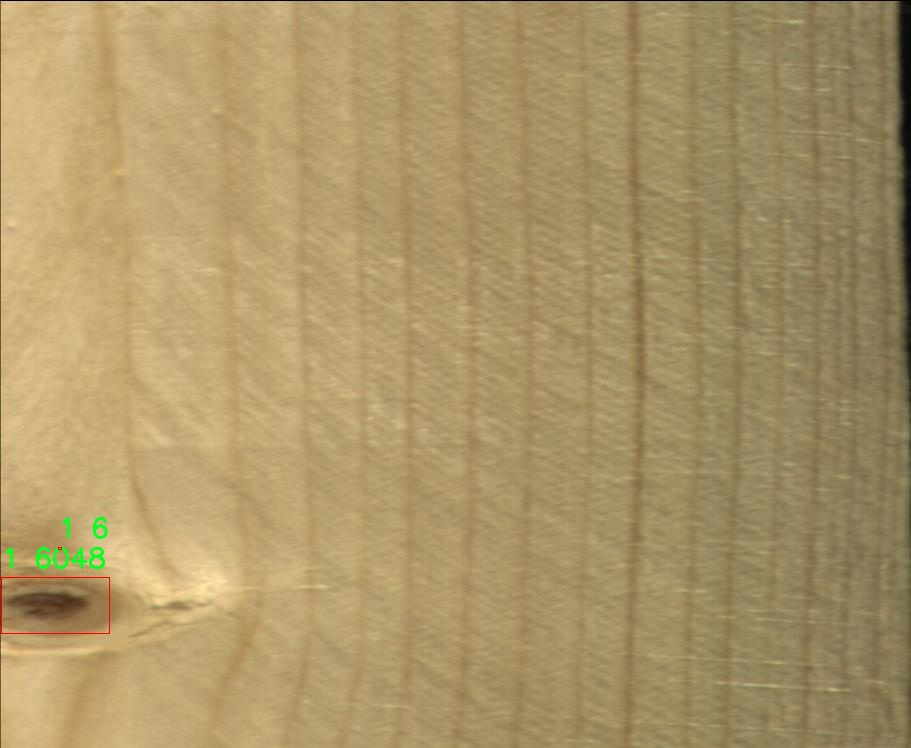
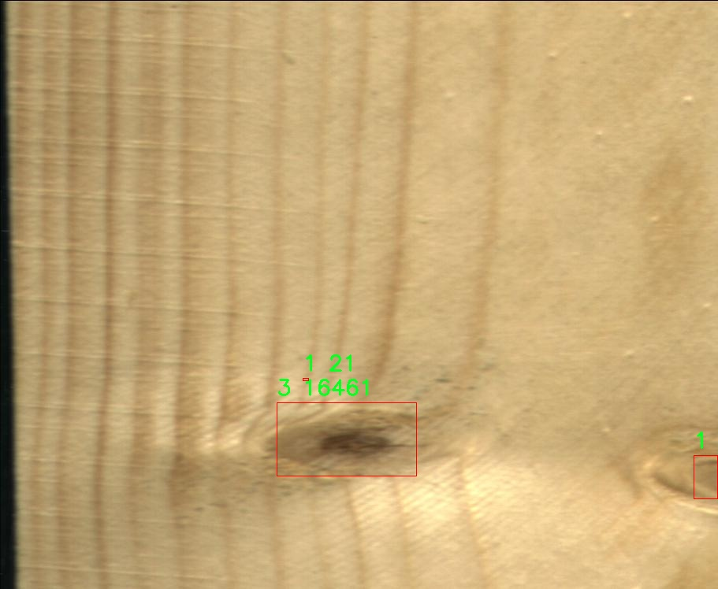
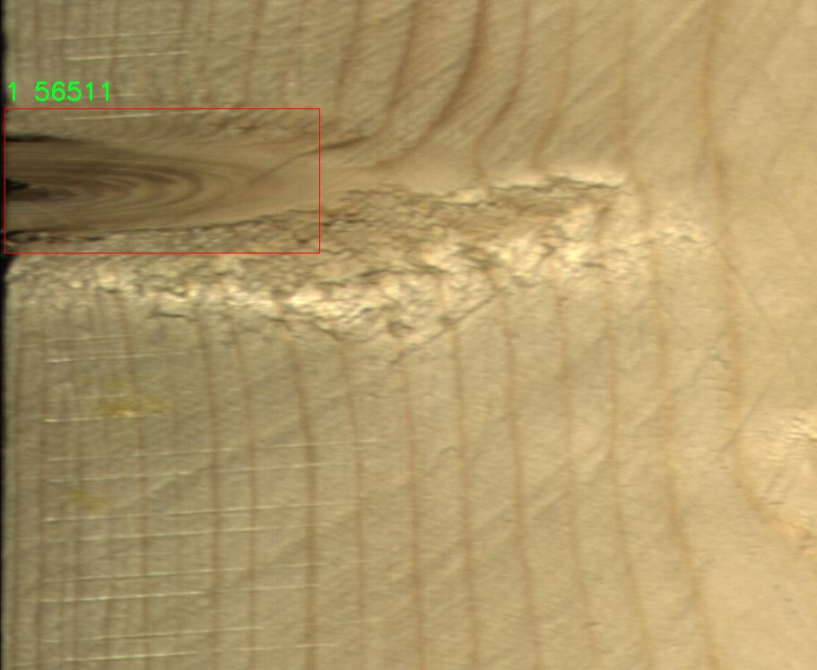

# 木材裂纹检测检测系统源码分享
 # [一条龙教学YOLOV8标注好的数据集一键训练_70+全套改进创新点发刊_Web前端展示]

### 1.研究背景与意义

项目参考[AAAI Association for the Advancement of Artificial Intelligence](https://gitee.com/qunshansj/projects)

项目来源[AACV Association for the Advancement of Computer Vision](https://gitee.com/qunmasj/projects)

研究背景与意义

随着全球对可持续发展和资源利用效率的日益关注，木材作为一种重要的自然资源，其质量检测与管理显得尤为重要。木材在建筑、家具制造及其他工业领域中广泛应用，其物理和机械性能直接影响到产品的安全性和耐用性。木材裂纹是影响木材质量的主要因素之一，裂纹不仅降低了木材的美观性，还可能导致结构强度的下降，增加了使用过程中的安全隐患。因此，及时、准确地检测木材裂纹，成为木材加工和使用过程中亟待解决的问题。

传统的木材裂纹检测方法多依赖人工视觉检查，这种方法不仅耗时耗力，而且容易受到主观因素的影响，导致检测结果的不一致性和不准确性。随着计算机视觉技术的快速发展，基于深度学习的自动化检测方法逐渐成为研究热点。YOLO（You Only Look Once）系列模型因其高效的实时目标检测能力而受到广泛关注。YOLOv8作为该系列的最新版本，具有更强的特征提取能力和更快的处理速度，为木材裂纹检测提供了新的技术手段。

本研究旨在基于改进的YOLOv8模型，构建一个高效的木材裂纹检测系统。为此，我们采用了名为“3knot_with_crack”的数据集，该数据集包含1600张图像，涵盖9个不同类别的木材裂纹特征。这些类别的细分不仅有助于提高模型的识别精度，也为不同类型裂纹的分析提供了基础。通过对该数据集的深入研究，我们能够更好地理解木材裂纹的多样性和复杂性，从而为模型的训练和优化提供依据。

在实际应用中，木材裂纹检测系统的有效性将直接影响到木材的使用安全和经济效益。通过引入改进的YOLOv8模型，我们期望能够显著提高裂纹检测的准确率和效率，降低人工检测的成本。此外，自动化检测系统的建立将为木材行业的智能化转型提供支持，推动相关技术的进步和应用。

本研究的意义不仅在于技术层面的创新，更在于对木材行业可持续发展的推动。通过高效的裂纹检测系统，能够有效减少木材资源的浪费，提高木材的利用率，促进绿色建筑和可持续发展理念的实现。同时，研究成果也可为其他材料的缺陷检测提供借鉴，具有广泛的应用前景。

综上所述，基于改进YOLOv8的木材裂纹检测系统的研究，不仅具有重要的理论价值，也具备显著的实际应用意义。通过对木材裂纹的精准检测，我们将为木材行业的安全管理和资源优化提供强有力的技术支持，推动行业的健康发展。

### 2.图片演示







##### 注意：由于此博客编辑较早，上面“2.图片演示”和“3.视频演示”展示的系统图片或者视频可能为老版本，新版本在老版本的基础上升级如下：（实际效果以升级的新版本为准）

  （1）适配了YOLOV8的“目标检测”模型和“实例分割”模型，通过加载相应的权重（.pt）文件即可自适应加载模型。

  （2）支持“图片识别”、“视频识别”、“摄像头实时识别”三种识别模式。

  （3）支持“图片识别”、“视频识别”、“摄像头实时识别”三种识别结果保存导出，解决手动导出（容易卡顿出现爆内存）存在的问题，识别完自动保存结果并导出到tempDir中。

  （4）支持Web前端系统中的标题、背景图等自定义修改，后面提供修改教程。

  另外本项目提供训练的数据集和训练教程,暂不提供权重文件（best.pt）,需要您按照教程进行训练后实现图片演示和Web前端界面演示的效果。

### 3.视频演示

[3.1 视频演示](https://www.bilibili.com/video/BV1TF4JefEk5/)

### 4.数据集信息展示

##### 4.1 本项目数据集详细数据（类别数＆类别名）

nc: 9
names: ['0', '1', '2', '3', '4', '5', '6', '7', '8']


##### 4.2 本项目数据集信息介绍

数据集信息展示

在现代木材裂纹检测系统的研究中，数据集的构建与选择至关重要。为此，我们使用了名为“3knot_with_crack”的数据集，旨在为改进YOLOv8模型提供高质量的训练数据。该数据集专注于木材表面裂纹的检测，涵盖了多种不同类型的裂纹和木材缺陷，能够有效地支持深度学习模型在实际应用中的表现。

“3knot_with_crack”数据集包含了九个类别，分别用数字“0”到“8”进行标识。这些类别不仅代表了不同类型的木材裂纹，还可能涵盖了裂纹的不同形态和严重程度。这种细致的分类方式使得模型在训练过程中能够学习到更为丰富的特征，从而提高检测的准确性和鲁棒性。例如，类别“0”可能代表轻微的表面裂纹，而类别“8”则可能对应于深度裂纹或严重的木材损伤。通过这种方式，数据集能够为模型提供多样化的样本，使其在面对各种实际情况时都能做出准确的判断。

在数据集的构建过程中，研究团队对每一类裂纹进行了精心的标注和分类。这一过程不仅需要专业的木材检测知识，还要求对裂纹的形态、位置及其对木材整体结构的影响有深入的理解。每一张图像都经过严格的审核，以确保其标注的准确性和一致性。这种高标准的标注过程使得“3knot_with_crack”数据集在质量上得到了保障，为后续的模型训练提供了坚实的基础。

此外，数据集的多样性也是其一大亮点。为了增强模型的泛化能力，数据集中的图像来源于不同的木材种类和不同的环境条件。这种多样性不仅能够帮助模型学习到不同类型木材的特征，还能使其在不同光照、背景和拍摄角度下依然保持良好的检测性能。通过这种方式，模型能够更好地适应实际应用场景中的复杂性，提高了其在真实环境中的实用价值。

在进行YOLOv8模型的训练时，研究团队将“3knot_with_crack”数据集的图像和相应的标注信息输入到模型中，利用深度学习算法进行特征提取和分类。模型通过不断的迭代训练，逐渐优化其参数，以提高对木材裂纹的检测精度和速度。最终，经过多轮训练和验证，模型能够在测试集上达到令人满意的性能，展现出其在木材裂纹检测领域的潜力。

总之，“3knot_with_crack”数据集不仅为改进YOLOv8模型提供了丰富的训练样本，也为木材裂纹检测技术的发展奠定了基础。通过高质量的标注、多样化的样本和严格的训练流程，该数据集在推动木材检测自动化和智能化方面发挥了重要作用，期待未来能够在实际应用中展现出更大的价值。











### 5.全套项目环境部署视频教程（零基础手把手教学）

[5.1 环境部署教程链接（零基础手把手教学）](https://www.ixigua.com/7404473917358506534?logTag=c807d0cbc21c0ef59de5)


[5.2 安装Python虚拟环境创建和依赖库安装视频教程链接（零基础手把手教学）](https://www.ixigua.com/7404474678003106304?logTag=1f1041108cd1f708b01a)

### 6.手把手YOLOV8训练视频教程（零基础小白有手就能学会）

[6.1 手把手YOLOV8训练视频教程（零基础小白有手就能学会）](https://www.ixigua.com/7404477157818401292?logTag=d31a2dfd1983c9668658)

### 7.70+种全套YOLOV8创新点代码加载调参视频教程（一键加载写好的改进模型的配置文件）

[7.1 70+种全套YOLOV8创新点代码加载调参视频教程（一键加载写好的改进模型的配置文件）](https://www.ixigua.com/7404478314661806627?logTag=29066f8288e3f4eea3a4)

### 8.70+种全套YOLOV8创新点原理讲解（非科班也可以轻松写刊发刊，V10版本正在科研待更新）

由于篇幅限制，每个创新点的具体原理讲解就不一一展开，具体见下列网址中的创新点对应子项目的技术原理博客网址【Blog】：


[8.1 70+种全套YOLOV8创新点原理讲解链接](https://gitee.com/qunmasj/good)

### 9.系统功能展示（检测对象为举例，实际内容以本项目数据集为准）

图9.1.系统支持检测结果表格显示

  图9.2.系统支持置信度和IOU阈值手动调节

  图9.3.系统支持自定义加载权重文件best.pt(需要你通过步骤5中训练获得)

  图9.4.系统支持摄像头实时识别

  图9.5.系统支持图片识别

  图9.6.系统支持视频识别

  图9.7.系统支持识别结果文件自动保存

  图9.8.系统支持Excel导出检测结果数据


### 10.原始YOLOV8算法原理

原始YOLOv8算法原理

YOLOv8算法作为YOLO系列的最新版本，标志着目标检测技术的又一次重大进步。它在YOLOv7的基础上进行了深度优化，旨在提升目标检测的精度和速度。YOLOv8的设计理念围绕着轻量化、高效性和高准确性展开，适应了现代计算机视觉应用的多样化需求。其架构主要由骨干特征提取网络、特征融合层和检测头层三部分组成，这种结构设计使得YOLOv8在处理复杂场景时表现出色。

在骨干特征提取网络层，YOLOv8引入了C2F模块，取代了传统的C3模块。C2F模块通过采用3×3的卷积核和深度为3、6、6、3的结构，显著降低了计算复杂度。这种轻量化设计不仅提高了模型的运行速度，还有效减少了内存占用，使得YOLOv8能够在资源受限的设备上高效运行。通过这种方式，YOLOv8能够在保持高精度的同时，提供更快的推理速度，适应实时检测的需求。

特征融合层是YOLOv8的另一个重要组成部分。该层结合了特征金字塔网络（FPN）和路径聚合网络（PAN），通过双向特征融合技术，有效提升了模型对不同尺度特征的提取能力。特别是BiFPN网络的引入，使得YOLOv8在特征融合过程中能够实现高效的双向跨尺度连接，进一步优化了特征的加权融合。这种设计不仅提高了特征信息的利用率，还增强了模型对小目标和复杂背景的适应能力，使得YOLOv8在各种应用场景中表现更加出色。

在检测头层，YOLOv8采用了轻量化的解耦头，取代了传统的耦合头。解耦头的设计理念是将目标检测任务中的分类和回归分支进行解耦，使得模型在进行目标定位和分类时能够更为高效。通过这种方式，YOLOv8实现了无锚目标检测，简化了检测过程，同时提升了检测精度。这一创新使得YOLOv8在面对复杂场景时，能够更好地识别和定位目标，尤其是在目标密集或重叠的情况下。

YOLOv8的另一个显著特点是其在训练和测试过程中采用了多尺度策略。这种策略使得模型能够在不同的输入尺度下进行训练，从而增强了其对各种尺寸目标的检测能力。通过多尺度训练，YOLOv8能够有效提高模型的泛化能力，使其在实际应用中能够更好地适应不同的环境和条件。

此外，YOLOv8在损失函数的设计上也进行了创新。新的损失函数考虑了目标检测中的多种因素，能够更准确地衡量模型的预测结果与真实标签之间的差距。这种设计不仅提高了模型的训练效率，还在一定程度上降低了过拟合的风险，使得YOLOv8在各种数据集上的表现更加稳定。

YOLOv8的应用范围广泛，包括智能监控、自动驾驶、无人机监测、人脸识别等多个领域。其高效的目标检测能力和实时处理能力，使得YOLOv8成为现代计算机视觉任务中的一个重要工具。通过对YOLOv8的不断优化和改进，研究人员和工程师们能够在各种复杂场景中实现更高效、更准确的目标检测，推动了智能技术的发展。

综上所述，YOLOv8算法通过一系列创新和优化，显著提升了目标检测的性能。其轻量化的设计、高效的特征提取和融合策略、解耦的检测头以及多尺度训练等特点，使得YOLOv8在目标检测领域中脱颖而出。随着YOLOv8的广泛应用，未来的计算机视觉技术将更加智能化和高效化，为各行各业带来更多的便利和可能性。


### 11.项目核心源码讲解（再也不用担心看不懂代码逻辑）

#### 11.1 code\ultralytics\engine\results.py

以下是对代码中最核心部分的提取和详细中文注释：

```python
class BaseTensor(SimpleClass):
    """基础张量类，提供额外的方法以便于操作和设备管理。"""

    def __init__(self, data, orig_shape) -> None:
        """
        初始化BaseTensor，包含数据和原始形状。

        参数:
            data (torch.Tensor | np.ndarray): 预测结果，如边界框、掩码和关键点。
            orig_shape (tuple): 图像的原始形状。
        """
        assert isinstance(data, (torch.Tensor, np.ndarray))  # 确保数据是张量或数组
        self.data = data  # 存储数据
        self.orig_shape = orig_shape  # 存储原始形状

    @property
    def shape(self):
        """返回数据张量的形状。"""
        return self.data.shape

    def cpu(self):
        """返回一个在CPU内存上的张量副本。"""
        return self if isinstance(self.data, np.ndarray) else self.__class__(self.data.cpu(), self.orig_shape)

    def numpy(self):
        """返回一个作为numpy数组的张量副本。"""
        return self if isinstance(self.data, np.ndarray) else self.__class__(self.data.numpy(), self.orig_shape)

    def cuda(self):
        """返回一个在GPU内存上的张量副本。"""
        return self.__class__(torch.as_tensor(self.data).cuda(), self.orig_shape)

    def to(self, *args, **kwargs):
        """返回一个在指定设备和数据类型上的张量副本。"""
        return self.__class__(torch.as_tensor(self.data).to(*args, **kwargs), self.orig_shape)

    def __len__(self):  # 重写len(results)
        """返回数据张量的长度。"""
        return len(self.data)

    def __getitem__(self, idx):
        """返回指定索引的数据张量的BaseTensor副本。"""
        return self.__class__(self.data[idx], self.orig_shape)


class Results(SimpleClass):
    """
    存储和操作推理结果的类。

    参数:
        orig_img (numpy.ndarray): 原始图像的numpy数组。
        path (str): 图像文件的路径。
        names (dict): 类名的字典。
        boxes (torch.tensor, optional): 每个检测的边界框坐标的2D张量。
        masks (torch.tensor, optional): 检测掩码的3D张量，每个掩码是一个二进制图像。
        probs (torch.tensor, optional): 每个类的概率的1D张量。
        keypoints (List[List[float]], optional): 每个对象的检测关键点的列表。
    """

    def __init__(self, orig_img, path, names, boxes=None, masks=None, probs=None, keypoints=None) -> None:
        """初始化Results类。"""
        self.orig_img = orig_img  # 存储原始图像
        self.orig_shape = orig_img.shape[:2]  # 存储原始图像的形状
        self.boxes = Boxes(boxes, self.orig_shape) if boxes is not None else None  # 存储边界框
        self.masks = Masks(masks, self.orig_shape) if masks is not None else None  # 存储掩码
        self.probs = Probs(probs) if probs is not None else None  # 存储概率
        self.keypoints = Keypoints(keypoints, self.orig_shape) if keypoints is not None else None  # 存储关键点
        self.names = names  # 存储类名
        self.path = path  # 存储图像路径

    def __getitem__(self, idx):
        """返回指定索引的Results对象。"""
        return self._apply("__getitem__", idx)

    def __len__(self):
        """返回Results对象中的检测数量。"""
        for k in ("boxes", "masks", "probs", "keypoints"):
            v = getattr(self, k)
            if v is not None:
                return len(v)

    def update(self, boxes=None, masks=None, probs=None):
        """更新Results对象的boxes、masks和probs属性。"""
        if boxes is not None:
            self.boxes = Boxes(ops.clip_boxes(boxes, self.orig_shape), self.orig_shape)
        if masks is not None:
            self.masks = Masks(masks, self.orig_shape)
        if probs is not None:
            self.probs = probs

    def plot(self, conf=True, labels=True, boxes=True, masks=True):
        """
        在输入RGB图像上绘制检测结果。

        参数:
            conf (bool): 是否绘制检测置信度分数。
            labels (bool): 是否绘制边界框的标签。
            boxes (bool): 是否绘制边界框。
            masks (bool): 是否绘制掩码。

        返回:
            (numpy.ndarray): 注释后的图像的numpy数组。
        """
        # 绘制边界框和掩码的逻辑
        # 略去具体实现细节，主要是调用Annotator类来进行绘制
        pass

    def save_txt(self, txt_file, save_conf=False):
        """
        将预测结果保存到txt文件中。

        参数:
            txt_file (str): txt文件路径。
            save_conf (bool): 是否保存置信度分数。
        """
        # 保存检测结果的逻辑
        # 略去具体实现细节
        pass


class Boxes(BaseTensor):
    """
    存储和操作检测框的类。

    参数:
        boxes (torch.Tensor | numpy.ndarray): 包含检测框的张量或数组。
        orig_shape (tuple): 原始图像大小。
    """

    def __init__(self, boxes, orig_shape) -> None:
        """初始化Boxes类。"""
        if boxes.ndim == 1:
            boxes = boxes[None, :]  # 确保boxes是二维的
        n = boxes.shape[-1]
        assert n in (6, 7), f"expected 6 or 7 values but got {n}"  # 确保数据格式正确
        super().__init__(boxes, orig_shape)  # 调用父类构造函数
        self.orig_shape = orig_shape  # 存储原始形状

    @property
    def xyxy(self):
        """返回xyxy格式的边界框。"""
        return self.data[:, :4]

    @property
    def conf(self):
        """返回边界框的置信度值。"""
        return self.data[:, -2]

    @property
    def cls(self):
        """返回边界框的类值。"""
        return self.data[:, -1]


class Masks(BaseTensor):
    """
    存储和操作检测掩码的类。
    """

    def __init__(self, masks, orig_shape) -> None:
        """初始化Masks类。"""
        if masks.ndim == 2:
            masks = masks[None, :]  # 确保masks是二维的
        super().__init__(masks, orig_shape)  # 调用父类构造函数

    @property
    def xyn(self):
        """返回归一化的分段。"""
        return [
            ops.scale_coords(self.data.shape[1:], x, self.orig_shape, normalize=True)
            for x in ops.masks2segments(self.data)
        ]


class Keypoints(BaseTensor):
    """
    存储和操作检测关键点的类。
    """

    def __init__(self, keypoints, orig_shape) -> None:
        """初始化Keypoints类。"""
        if keypoints.ndim == 2:
            keypoints = keypoints[None, :]  # 确保keypoints是二维的
        super().__init__(keypoints, orig_shape)  # 调用父类构造函数

    @property
    def xy(self):
        """返回关键点的x, y坐标。"""
        return self.data[..., :2]

    @property
    def conf(self):
        """返回关键点的置信度值。"""
        return self.data[..., 2] if self.data.shape[-1] == 3 else None
```

### 核心部分说明：
1. **BaseTensor**：基础类，提供了数据的基本操作和设备管理功能。
2. **Results**：存储推理结果的类，包含原始图像、边界框、掩码、概率和关键点等信息，并提供更新和绘制结果的方法。
3. **Boxes、Masks、Keypoints**：分别用于存储和操作检测框、掩码和关键点的类，提供了获取相关信息的属性。

以上代码提取了核心部分，并添加了详细的中文注释，以便于理解每个类和方法的功能。

这个文件是Ultralytics YOLO模型的一部分，主要用于处理推理结果，包括边界框、掩膜和关键点等。它定义了一些类来存储和操作这些结果，以便于后续的分析和可视化。

首先，`BaseTensor`类是一个基础类，提供了一些用于处理张量的通用方法，比如在CPU和GPU之间移动数据、转换为NumPy数组等。它确保了输入数据是一个张量或NumPy数组，并提供了获取数据形状和索引的功能。

接下来是`Results`类，它用于存储推理结果，包括原始图像、路径、类别名称、边界框、掩膜、概率和关键点等。这个类还包含了一些方法来更新结果、应用函数到所有非空属性、将结果复制到不同设备、绘制检测结果、保存结果到文本文件或JSON格式等。通过这些方法，用户可以方便地处理和可视化检测结果。

`Boxes`、`Masks`、`Keypoints`、`Probs`和`OBB`类分别用于处理边界框、掩膜、关键点、分类概率和定向边界框（OBB）。这些类继承自`BaseTensor`，并提供了特定于各自数据类型的属性和方法。例如，`Boxes`类提供了获取边界框坐标、置信度和类别的方法；`Masks`类则处理检测掩膜的相关操作；`Keypoints`类用于处理关键点的坐标和置信度；`Probs`类用于存储分类的概率信息；而`OBB`类则专门处理带有旋转信息的边界框。

在绘制检测结果时，`Results`类的`plot`方法允许用户在输入图像上绘制检测到的边界框、掩膜、关键点和分类概率等信息。用户可以自定义绘制的样式，比如线宽、字体大小和是否显示置信度等。

总的来说，这个文件提供了一整套处理YOLO模型推理结果的工具，使得用户能够方便地获取、更新和可视化检测结果，适用于各种计算机视觉任务。

#### 11.2 ui.py

```python
import sys
import subprocess

def run_script(script_path):
    """
    使用当前 Python 环境运行指定的脚本。

    Args:
        script_path (str): 要运行的脚本路径

    Returns:
        None
    """
    # 获取当前 Python 解释器的路径
    python_path = sys.executable

    # 构建运行命令
    command = f'"{python_path}" -m streamlit run "{script_path}"'

    # 执行命令
    result = subprocess.run(command, shell=True)
    if result.returncode != 0:
        print("脚本运行出错。")


# 实例化并运行应用
if __name__ == "__main__":
    # 指定您的脚本路径
    script_path = "web.py"  # 这里可以直接指定脚本路径

    # 运行脚本
    run_script(script_path)
```

### 代码注释

1. **导入模块**：
   - `import sys`：导入 `sys` 模块，用于访问与 Python 解释器紧密相关的变量和函数。
   - `import subprocess`：导入 `subprocess` 模块，用于生成新进程、连接到它们的输入/输出/错误管道，并获取它们的返回码。

2. **定义函数 `run_script`**：
   - 该函数接收一个参数 `script_path`，表示要运行的 Python 脚本的路径。
   - 函数内部首先获取当前 Python 解释器的路径，存储在 `python_path` 变量中。
   - 然后构建一个命令字符串 `command`，用于运行指定的脚本。命令使用 `streamlit` 模块来运行 Python 脚本。
   - 使用 `subprocess.run` 方法执行命令，并将 `shell=True` 作为参数，表示在 shell 中执行命令。
   - 如果命令执行的返回码不为 0，表示执行出错，打印错误信息。

3. **主程序入口**：
   - `if __name__ == "__main__":`：这行代码确保只有在直接运行该脚本时，以下代码才会被执行。
   - 指定要运行的脚本路径 `script_path`，这里直接使用 `"web.py"`。
   - 调用 `run_script` 函数，传入脚本路径以执行该脚本。

这个程序文件的主要功能是通过当前的 Python 环境来运行一个指定的脚本，具体来说是运行一个名为 `web.py` 的脚本。程序首先导入了必要的模块，包括 `sys`、`os` 和 `subprocess`，这些模块分别用于获取系统信息、处理文件路径和执行外部命令。

在程序中定义了一个名为 `run_script` 的函数，该函数接受一个参数 `script_path`，表示要运行的脚本的路径。函数内部首先获取当前 Python 解释器的路径，这通过 `sys.executable` 实现。接着，构建一个命令字符串，该命令使用 `streamlit` 模块来运行指定的脚本。`streamlit` 是一个用于构建数据应用的 Python 库。

然后，使用 `subprocess.run` 方法来执行构建好的命令。这个方法会在一个新的 shell 中运行命令，并等待其完成。如果命令执行的返回码不为零，表示脚本运行过程中出现了错误，程序会打印出“脚本运行出错”的提示信息。

在文件的最后部分，使用 `if __name__ == "__main__":` 语句来确保当该文件作为主程序运行时才会执行下面的代码。这里指定了要运行的脚本路径 `web.py`，并调用 `run_script` 函数来执行该脚本。

整体来看，这个程序文件的设计简单明了，主要是为了方便用户在当前 Python 环境中运行一个特定的脚本，并能够处理可能出现的错误。

#### 11.3 70+种YOLOv8算法改进源码大全和调试加载训练教程（非必要）\ultralytics\utils\instance.py

以下是代码中最核心的部分，并附上详细的中文注释：

```python
import numpy as np

class Bboxes:
    """
    处理边界框的类，支持多种边界框格式，如 'xyxy', 'xywh', 和 'ltwh'。
    边界框数据应以 numpy 数组的形式提供。

    属性:
        bboxes (numpy.ndarray): 存储边界框的二维 numpy 数组。
        format (str): 边界框的格式 ('xyxy', 'xywh', 或 'ltwh')。
    """

    def __init__(self, bboxes, format='xyxy') -> None:
        """初始化 Bboxes 类，指定边界框数据的格式。"""
        # 确保格式有效
        assert format in ['xyxy', 'xywh', 'ltwh'], f'无效的边界框格式: {format}'
        # 如果输入是一维数组，则将其转换为二维数组
        bboxes = bboxes[None, :] if bboxes.ndim == 1 else bboxes
        # 确保输入为二维数组且每个边界框有四个坐标
        assert bboxes.ndim == 2
        assert bboxes.shape[1] == 4
        self.bboxes = bboxes  # 存储边界框
        self.format = format  # 存储边界框格式

    def convert(self, format):
        """将边界框格式从一种类型转换为另一种类型。"""
        assert format in ['xyxy', 'xywh', 'ltwh'], f'无效的边界框格式: {format}'
        if self.format == format:
            return  # 如果格式相同，则不需要转换
        # 根据当前格式和目标格式选择转换函数
        if self.format == 'xyxy':
            func = xyxy2xywh if format == 'xywh' else xyxy2ltwh
        elif self.format == 'xywh':
            func = xywh2xyxy if format == 'xyxy' else xywh2ltwh
        else:
            func = ltwh2xyxy if format == 'xyxy' else ltwh2xywh
        self.bboxes = func(self.bboxes)  # 执行转换
        self.format = format  # 更新格式

    def areas(self):
        """返回每个边界框的面积。"""
        self.convert('xyxy')  # 确保边界框格式为 'xyxy'
        # 计算面积: (右下角x - 左上角x) * (右下角y - 左上角y)
        return (self.bboxes[:, 2] - self.bboxes[:, 0]) * (self.bboxes[:, 3] - self.bboxes[:, 1])

    def __len__(self):
        """返回边界框的数量。"""
        return len(self.bboxes)

class Instances:
    """
    存储图像中检测到的对象的边界框、分段和关键点的容器。

    属性:
        _bboxes (Bboxes): 内部对象，用于处理边界框操作。
        keypoints (ndarray): 关键点数组，形状为 [N, 17, 3]，默认为 None。
        segments (ndarray): 分段数组，形状为 [N, 1000, 2]，经过重采样。
    """

    def __init__(self, bboxes, segments=None, keypoints=None, bbox_format='xywh', normalized=True) -> None:
        """
        初始化 Instances 对象。

        参数:
            bboxes (ndarray): 形状为 [N, 4] 的边界框数组。
            segments (list | ndarray): 对象分段的列表或数组，默认为 None。
            keypoints (ndarray): 形状为 [N, 17, 3] 的关键点数组，默认为 None。
        """
        self._bboxes = Bboxes(bboxes=bboxes, format=bbox_format)  # 初始化边界框
        self.keypoints = keypoints  # 存储关键点
        self.normalized = normalized  # 标记是否已归一化

        # 处理分段数据
        if segments is None:
            segments = []
        if len(segments) > 0:
            segments = resample_segments(segments)  # 重采样分段
            segments = np.stack(segments, axis=0)  # 转换为 numpy 数组
        else:
            segments = np.zeros((0, 1000, 2), dtype=np.float32)  # 初始化为空的分段数组
        self.segments = segments  # 存储分段数据

    @property
    def bboxes(self):
        """返回边界框。"""
        return self._bboxes.bboxes  # 访问内部 Bboxes 对象的边界框
```

### 代码说明
1. **Bboxes 类**:
   - 用于处理边界框，支持多种格式（`xyxy`, `xywh`, `ltwh`）。
   - 初始化时会检查输入的格式和维度，确保数据有效。
   - 提供了格式转换和计算面积的方法。

2. **Instances 类**:
   - 用于存储图像中检测到的对象的边界框、分段和关键点。
   - 初始化时会处理边界框、分段和关键点，确保数据的正确性。
   - 提供了对边界框的访问属性。

这段代码的核心在于边界框的管理和转换，确保在不同格式之间的灵活使用。

这个程序文件主要定义了两个类：`Bboxes`和`Instances`，用于处理图像中的边界框（bounding boxes）、分割（segments）和关键点（keypoints）。这些类为YOLOv8算法的实现提供了基础数据结构和操作方法。

首先，`Bboxes`类用于管理边界框。它支持多种边界框格式，包括`xyxy`（左上角和右下角坐标）、`xywh`（中心坐标和宽高）以及`ltwh`（左上角坐标和宽高）。在初始化时，`Bboxes`类会检查输入的格式是否有效，并确保边界框数据是一个二维的NumPy数组。该类提供了多种方法来转换边界框格式、计算面积、缩放和偏移边界框等操作。

在`Bboxes`类中，`convert`方法用于将边界框从一种格式转换为另一种格式。`areas`方法计算所有边界框的面积。`mul`和`add`方法分别用于缩放和偏移边界框的坐标。`__len__`方法返回边界框的数量，而`concatenate`类方法则可以将多个`Bboxes`对象合并为一个新的`Bboxes`对象。

接下来，`Instances`类是一个更复杂的容器，除了边界框外，还可以存储分割和关键点信息。该类的构造函数接收边界框、分割和关键点的数组，并进行必要的初始化和处理。`Instances`类同样提供了转换边界框格式、计算边界框面积、缩放、归一化和去除零面积框等功能。

在`Instances`类中，`scale`、`denormalize`和`normalize`方法用于处理边界框、分割和关键点的缩放和归一化。`add_padding`方法用于处理图像拼接时的边界框调整。`flipud`和`fliplr`方法分别用于垂直和水平翻转边界框、分割和关键点的坐标。`clip`方法确保所有的边界框和分割坐标都在图像边界内。

此外，`Instances`类还提供了`remove_zero_area_boxes`方法，用于移除面积为零的边界框。`update`方法可以更新实例的边界框、分割和关键点信息。最后，`concatenate`类方法可以将多个`Instances`对象合并为一个新的`Instances`对象。

总的来说，这个文件为YOLOv8算法的实现提供了边界框和实例管理的基础功能，支持多种格式的转换和处理，便于后续的目标检测和图像分析任务。

#### 11.4 train.py

以下是经过简化和注释的核心代码部分，主要集中在YOLO检测模型的训练过程。

```python
import random
import numpy as np
import torch.nn as nn
from ultralytics.data import build_dataloader, build_yolo_dataset
from ultralytics.engine.trainer import BaseTrainer
from ultralytics.models import yolo
from ultralytics.nn.tasks import DetectionModel
from ultralytics.utils import LOGGER, RANK
from ultralytics.utils.torch_utils import de_parallel, torch_distributed_zero_first

class DetectionTrainer(BaseTrainer):
    """
    基于检测模型的训练类，继承自BaseTrainer类。
    """

    def build_dataset(self, img_path, mode="train", batch=None):
        """
        构建YOLO数据集。

        参数:
            img_path (str): 包含图像的文件夹路径。
            mode (str): 模式，'train'或'val'，用户可以为每种模式自定义不同的数据增强。
            batch (int, optional): 批次大小，仅用于'rect'模式。默认为None。
        """
        gs = max(int(de_parallel(self.model).stride.max() if self.model else 0), 32)  # 获取模型的最大步幅
        return build_yolo_dataset(self.args, img_path, batch, self.data, mode=mode, rect=mode == "val", stride=gs)

    def get_dataloader(self, dataset_path, batch_size=16, rank=0, mode="train"):
        """构建并返回数据加载器。"""
        assert mode in ["train", "val"]  # 确保模式有效
        with torch_distributed_zero_first(rank):  # 仅在DDP中初始化数据集*.cache一次
            dataset = self.build_dataset(dataset_path, mode, batch_size)  # 构建数据集
        shuffle = mode == "train"  # 训练模式下打乱数据
        workers = self.args.workers if mode == "train" else self.args.workers * 2  # 设置工作线程数
        return build_dataloader(dataset, batch_size, workers, shuffle, rank)  # 返回数据加载器

    def preprocess_batch(self, batch):
        """对图像批次进行预处理，包括缩放和转换为浮点数。"""
        batch["img"] = batch["img"].to(self.device, non_blocking=True).float() / 255  # 将图像转移到设备并归一化
        if self.args.multi_scale:  # 如果启用多尺度
            imgs = batch["img"]
            sz = (
                random.randrange(self.args.imgsz * 0.5, self.args.imgsz * 1.5 + self.stride)
                // self.stride
                * self.stride
            )  # 随机选择新的尺寸
            sf = sz / max(imgs.shape[2:])  # 计算缩放因子
            if sf != 1:
                ns = [
                    math.ceil(x * sf / self.stride) * self.stride for x in imgs.shape[2:]
                ]  # 计算新的形状
                imgs = nn.functional.interpolate(imgs, size=ns, mode="bilinear", align_corners=False)  # 调整图像大小
            batch["img"] = imgs  # 更新批次图像
        return batch

    def get_model(self, cfg=None, weights=None, verbose=True):
        """返回YOLO检测模型。"""
        model = DetectionModel(cfg, nc=self.data["nc"], verbose=verbose and RANK == -1)  # 创建检测模型
        if weights:
            model.load(weights)  # 加载权重
        return model

    def plot_training_samples(self, batch, ni):
        """绘制带有注释的训练样本。"""
        plot_images(
            images=batch["img"],
            batch_idx=batch["batch_idx"],
            cls=batch["cls"].squeeze(-1),
            bboxes=batch["bboxes"],
            paths=batch["im_file"],
            fname=self.save_dir / f"train_batch{ni}.jpg",
            on_plot=self.on_plot,
        )

    def plot_metrics(self):
        """从CSV文件中绘制指标。"""
        plot_results(file=self.csv, on_plot=self.on_plot)  # 保存结果图
```

### 代码说明
1. **DetectionTrainer类**: 这是一个用于训练YOLO检测模型的类，继承自`BaseTrainer`。
2. **build_dataset方法**: 用于构建YOLO数据集，支持训练和验证模式。
3. **get_dataloader方法**: 创建数据加载器，支持多进程加载和数据打乱。
4. **preprocess_batch方法**: 对输入的图像批次进行预处理，包括归一化和调整图像大小。
5. **get_model方法**: 创建并返回YOLO检测模型，可以选择加载预训练权重。
6. **plot_training_samples和plot_metrics方法**: 用于可视化训练样本和训练过程中的指标。

这个程序文件 `train.py` 是一个用于训练 YOLO（You Only Look Once）目标检测模型的实现，继承自 `BaseTrainer` 类。它主要负责构建数据集、数据加载器、模型、损失计算和训练过程中的一些可视化功能。

首先，程序导入了必要的库和模块，包括数学计算、随机数生成、深度学习框架 PyTorch 相关的模块，以及 Ultralytics 提供的各种工具和函数。这些工具包括数据加载、模型构建、训练器、日志记录等。

在 `DetectionTrainer` 类中，`build_dataset` 方法用于构建 YOLO 数据集。它接收图像路径、模式（训练或验证）和批次大小作为参数，并根据模型的步幅来调整数据集的构建。`get_dataloader` 方法则负责创建数据加载器，确保在分布式训练时只初始化一次数据集，并根据模式选择是否打乱数据。

`preprocess_batch` 方法用于对图像批次进行预处理，包括将图像缩放到合适的大小并转换为浮点数格式。该方法还支持多尺度训练，通过随机选择图像大小来增强模型的鲁棒性。

`set_model_attributes` 方法用于设置模型的属性，包括类别数量和类别名称。这些信息是训练过程中必需的，确保模型能够正确识别和分类目标。

`get_model` 方法返回一个 YOLO 检测模型实例，并可选择加载预训练权重。`get_validator` 方法则返回一个用于验证模型性能的验证器。

在训练过程中，`label_loss_items` 方法用于返回带有标签的损失字典，方便跟踪训练过程中的损失变化。`progress_string` 方法返回一个格式化的字符串，显示训练进度，包括当前的轮次、GPU 内存使用情况和损失值。

此外，程序还包含一些可视化功能，如 `plot_training_samples` 方法用于绘制训练样本及其标注，`plot_metrics` 方法用于绘制训练过程中的指标，`plot_training_labels` 方法则用于创建带标签的训练图。

总体而言，这个程序文件为 YOLO 模型的训练提供了一个完整的框架，涵盖了数据处理、模型构建、训练过程管理和结果可视化等多个方面。

#### 11.5 70+种YOLOv8算法改进源码大全和调试加载训练教程（非必要）\ultralytics\models\yolo\segment\__init__.py

```python
# 导入必要的模块
from .predict import SegmentationPredictor  # 导入分割预测器类
from .train import SegmentationTrainer      # 导入分割训练器类
from .val import SegmentationValidator      # 导入分割验证器类

# 定义模块的公开接口，指定可以被外部访问的类
__all__ = 'SegmentationPredictor', 'SegmentationTrainer', 'SegmentationValidator'
```

### 代码注释说明：
1. **导入模块**：
   - `from .predict import SegmentationPredictor`：从当前包的 `predict` 模块中导入 `SegmentationPredictor` 类，该类负责处理图像分割的预测任务。
   - `from .train import SegmentationTrainer`：从当前包的 `train` 模块中导入 `SegmentationTrainer` 类，该类用于训练分割模型。
   - `from .val import SegmentationValidator`：从当前包的 `val` 模块中导入 `SegmentationValidator` 类，该类用于验证分割模型的性能。

2. **定义公开接口**：
   - `__all__` 是一个特殊变量，用于定义模块的公共接口。它指定了在使用 `from module import *` 时，哪些类可以被导入。在这里，只有 `SegmentationPredictor`、`SegmentationTrainer` 和 `SegmentationValidator` 这三个类可以被外部访问。

这个程序文件是YOLO（You Only Look Once）系列算法的一部分，具体是与分割（Segmentation）相关的模块。文件名表明这是一个关于YOLOv8算法改进的源码集合以及调试、加载和训练的教程。

在文件的开头，有一个注释，指出这是Ultralytics YOLO的代码，并且遵循AGPL-3.0许可证。这意味着该代码是开源的，用户可以自由使用和修改，但需要遵循相应的许可证条款。

接下来，文件通过`from`语句导入了三个类：`SegmentationPredictor`、`SegmentationTrainer`和`SegmentationValidator`。这些类分别用于不同的功能：`SegmentationPredictor`用于进行分割预测，`SegmentationTrainer`用于训练分割模型，而`SegmentationValidator`则用于验证模型的性能。

最后，`__all__`变量被定义为一个元组，包含了上述三个类的名称。这一行的作用是控制当使用`from module import *`语句时，哪些名称会被导入。通过定义`__all__`，可以明确指定模块的公共接口，避免不必要的名称被导入，从而提高代码的可读性和可维护性。

总体来说，这个文件是YOLOv8分割模块的初始化文件，负责导入和组织与分割相关的功能组件。

#### 11.6 code\ultralytics\trackers\bot_sort.py

以下是代码中最核心的部分，并附上详细的中文注释：

```python
class BOTrack(STrack):
    """
    BOTrack类是YOLOv8中STrack类的扩展版本，增加了对象跟踪功能。
    """

    shared_kalman = KalmanFilterXYWH()  # 所有BOTrack实例共享的卡尔曼滤波器

    def __init__(self, tlwh, score, cls, feat=None, feat_history=50):
        """初始化BOTrack实例，设置边界框、分数、类别和特征历史长度。"""
        super().__init__(tlwh, score, cls)  # 调用父类的初始化方法

        self.smooth_feat = None  # 平滑特征向量
        self.curr_feat = None  # 当前特征向量
        if feat is not None:
            self.update_features(feat)  # 如果提供特征，则更新特征
        self.features = deque([], maxlen=feat_history)  # 存储特征向量的双端队列，最大长度为feat_history
        self.alpha = 0.9  # 指数移动平均的平滑因子

    def update_features(self, feat):
        """更新特征向量，并使用指数移动平均进行平滑处理。"""
        feat /= np.linalg.norm(feat)  # 归一化特征向量
        self.curr_feat = feat  # 更新当前特征
        if self.smooth_feat is None:
            self.smooth_feat = feat  # 如果平滑特征为空，则直接赋值
        else:
            # 使用指数移动平均更新平滑特征
            self.smooth_feat = self.alpha * self.smooth_feat + (1 - self.alpha) * feat
        self.features.append(feat)  # 将当前特征添加到特征队列
        self.smooth_feat /= np.linalg.norm(self.smooth_feat)  # 归一化平滑特征

    def predict(self):
        """使用卡尔曼滤波器预测均值和协方差。"""
        mean_state = self.mean.copy()  # 复制当前均值状态
        if self.state != TrackState.Tracked:
            mean_state[6] = 0  # 如果状态不是跟踪状态，设置速度为0
            mean_state[7] = 0

        # 通过卡尔曼滤波器进行预测
        self.mean, self.covariance = self.kalman_filter.predict(mean_state, self.covariance)

    @property
    def tlwh(self):
        """获取当前边界框位置，格式为 (左上角 x, 左上角 y, 宽度, 高度)。"""
        if self.mean is None:
            return self._tlwh.copy()  # 如果均值为空，返回原始边界框
        ret = self.mean[:4].copy()  # 复制均值的前四个元素
        ret[:2] -= ret[2:] / 2  # 计算左上角坐标
        return ret  # 返回左上角坐标和宽高

class BOTSORT(BYTETracker):
    """
    BOTSORT类是BYTETracker类的扩展版本，专为YOLOv8设计，支持ReID和GMC算法的对象跟踪。
    """

    def __init__(self, args, frame_rate=30):
        """初始化BOTSORT实例，设置跟踪参数和GMC算法。"""
        super().__init__(args, frame_rate)  # 调用父类的初始化方法
        self.proximity_thresh = args.proximity_thresh  # 空间接近阈值
        self.appearance_thresh = args.appearance_thresh  # 外观相似性阈值

        if args.with_reid:
            self.encoder = None  # 如果启用ReID，初始化编码器（此处未实现）
        self.gmc = GMC(method=args.gmc_method)  # 初始化GMC算法

    def init_track(self, dets, scores, cls, img=None):
        """使用检测结果、分数和类别初始化跟踪。"""
        if len(dets) == 0:
            return []  # 如果没有检测结果，返回空列表
        if self.args.with_reid and self.encoder is not None:
            features_keep = self.encoder.inference(img, dets)  # 进行ReID特征提取
            return [BOTrack(xyxy, s, c, f) for (xyxy, s, c, f) in zip(dets, scores, cls, features_keep)]  # 返回BOTrack实例
        else:
            return [BOTrack(xyxy, s, c) for (xyxy, s, c) in zip(dets, scores, cls)]  # 返回BOTrack实例

    def multi_predict(self, tracks):
        """使用YOLOv8模型预测和跟踪多个对象。"""
        BOTrack.multi_predict(tracks)  # 调用BOTrack的多重预测方法
```

### 代码核心部分说明：
1. **BOTrack类**：扩展了STrack类，增加了特征更新和卡尔曼滤波器预测功能，主要用于跟踪对象。
2. **特征更新**：通过`update_features`方法更新当前特征，并使用指数移动平均进行平滑处理。
3. **预测功能**：使用卡尔曼滤波器的`predict`方法来预测对象的状态。
4. **BOTSORT类**：扩展了BYTETracker类，支持ReID和GMC算法，用于初始化跟踪和计算距离。

这个程序文件 `bot_sort.py` 是用于实现基于 YOLOv8 的目标跟踪算法的，主要包括两个类：`BOTrack` 和 `BOTSORT`。文件的核心功能是通过扩展的 Kalman 滤波器和 ReID（重识别）技术来跟踪视频中的对象。

`BOTrack` 类是 `STrack` 类的扩展，增加了对象跟踪的特性。它包含了一些重要的属性和方法。属性方面，`shared_kalman` 是一个共享的 Kalman 滤波器，用于所有 `BOTrack` 实例的状态预测；`smooth_feat` 和 `curr_feat` 分别表示平滑后的特征向量和当前特征向量；`features` 是一个双端队列，用于存储特征向量；`alpha` 是用于平滑特征的指数移动平均的平滑因子；`mean` 和 `covariance` 分别表示 Kalman 滤波器的均值状态和协方差矩阵。

在方法方面，`update_features` 用于更新特征向量并使用指数移动平均进行平滑；`predict` 方法使用 Kalman 滤波器预测当前状态的均值和协方差；`re_activate` 方法用于重新激活一个跟踪对象，并更新其特征；`update` 方法则用于更新 YOLOv8 实例的跟踪信息；`tlwh` 属性获取当前的边界框位置；`multi_predict` 方法用于对多个对象的状态进行预测；`convert_coords` 和 `tlwh_to_xywh` 方法用于坐标格式的转换。

`BOTSORT` 类是 `BYTETracker` 类的扩展，专为 YOLOv8 设计，支持对象跟踪、ReID 和 GMC（全局运动一致性）算法。它的属性包括空间接近阈值和外观相似性阈值，以及用于处理 ReID 嵌入的编码器和 GMC 实例。方法方面，`get_kalmanfilter` 返回一个 Kalman 滤波器实例；`init_track` 方法用于初始化跟踪，接受检测结果、分数和类别；`get_dists` 方法计算跟踪对象与检测对象之间的距离；`multi_predict` 方法用于对多个对象进行预测。

总体而言，这个文件实现了一个高效的目标跟踪系统，结合了 Kalman 滤波器、ReID 和 GMC 算法，以提高跟踪的准确性和鲁棒性。使用时，可以通过创建 `BOTSORT` 实例并调用其方法来进行目标跟踪。

### 12.系统整体结构（节选）

### 整体功能和构架概括

这个项目是一个完整的YOLOv8目标检测和跟踪系统，涵盖了从数据准备、模型训练到推理和结果处理的各个方面。它包括多个模块，每个模块负责特定的功能，如数据集构建、模型定义、训练过程管理、结果可视化、目标跟踪等。整体架构清晰，便于扩展和维护。

- **数据处理**：负责构建和加载数据集。
- **模型训练**：实现模型的训练和验证过程。
- **推理与结果处理**：处理模型的输出结果，进行可视化和分析。
- **目标跟踪**：实现目标在视频中的跟踪功能。
- **模块化设计**：各个功能模块相对独立，便于重用和修改。

### 文件功能整理表

| 文件路径                                                                                          | 功能描述                                                       |
|---------------------------------------------------------------------------------------------------|--------------------------------------------------------------|
| `code\ultralytics\engine\results.py`                                                             | 处理推理结果，包括边界框、掩膜和关键点的存储和可视化。               |
| `ui.py`                                                                                           | 运行指定的脚本（如`web.py`），提供一个简单的用户界面。               |
| `70+种YOLOv8算法改进源码大全和调试加载训练教程（非必要）\ultralytics\utils\instance.py`         | 管理边界框和实例，提供数据结构和操作方法。                          |
| `train.py`                                                                                        | 负责训练YOLO模型，包括数据加载、模型构建和训练过程管理。              |
| `70+种YOLOv8算法改进源码大全和调试加载训练教程（非必要）\ultralytics\models\yolo\segment\__init__.py` | 初始化分割模块，导入与分割相关的功能组件。                           |
| `code\ultralytics\trackers\bot_sort.py`                                                         | 实现基于YOLOv8的目标跟踪算法，结合Kalman滤波器和ReID技术。            |
| `70+种YOLOv8算法改进源码大全和调试加载训练教程（非必要）\ultralytics\nn\extra_modules\orepa.py` | 提供额外的模块或功能，具体功能待分析。                               |
| `code\ultralytics\utils\callbacks\raytune.py`                                                   | 实现与Ray Tune集成的回调功能，用于超参数调优。                        |
| `code\ultralytics\nn\modules\head.py`                                                           | 定义YOLO模型的头部结构，处理特征图的输出。                           |
| `70+种YOLOv8算法改进源码大全和调试加载训练教程（非必要）\ultralytics\nn\extra_modules\ops_dcnv3\functions\dcnv3_func.py` | 实现DCNv3（Deformable Convolutional Networks v3）相关的功能。        |
| `70+种YOLOv8算法改进源码大全和调试加载训练教程（非必要）\ultralytics\models\yolo\model.py`     | 定义YOLO模型的整体结构，包括网络层和前向传播逻辑。                    |
| `70+种YOLOv8算法改进源码大全和调试加载训练教程（非必要）\ultralytics\engine\__init__.py`       | 初始化引擎模块，导入与模型训练和推理相关的功能组件。                   |
| `70+种YOLOv8算法改进源码大全和调试加载训练教程（非必要）\ultralytics\data\build.py`          | 构建数据集，处理数据加载和预处理逻辑。                               |

这个表格总结了每个文件的主要功能，便于理解整个项目的结构和各个模块之间的关系。

注意：由于此博客编辑较早，上面“11.项目核心源码讲解（再也不用担心看不懂代码逻辑）”中部分代码可能会优化升级，仅供参考学习，完整“训练源码”、“Web前端界面”和“70+种创新点源码”以“13.完整训练+Web前端界面+70+种创新点源码、数据集获取”的内容为准。

### 13.完整训练+Web前端界面+70+种创新点源码、数据集获取


# [下载链接：https://mbd.pub/o/bread/ZpuUlJhr](https://mbd.pub/o/bread/ZpuUlJhr)